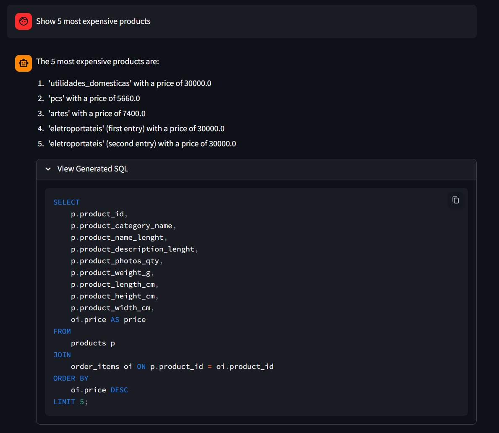
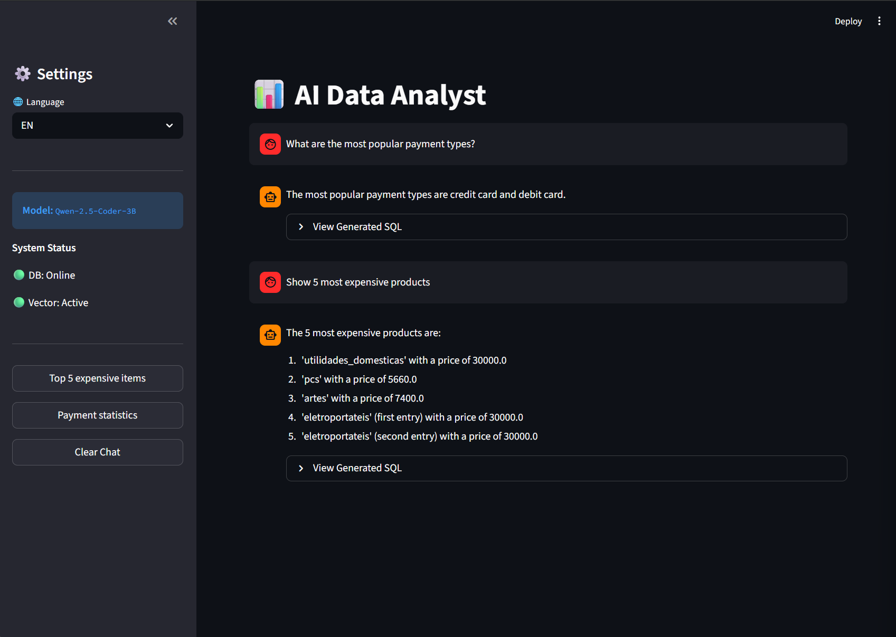

<div align="center">

# 🔍 InsightData Analyst

### RAG-Enhanced SQL Agent · Powered by Local LLM
*Ask questions about your database in plain language — no cloud, no data leaks*


---

## About

**InsightData Analyst** is an intelligent data analysis agent that translates natural language questions into precise SQL queries. The system runs **entirely locally** — no external APIs, no data sent to the cloud.

The core idea: the agent does not guess the database structure — it **retrieves actual table schemas from a vector store** (RAG) and generates SQL based on the real data architecture. If a query fails, the agent analyses the traceback and corrects the code automatically.

<br/>

| | |
|---|---|
|  |  |
| *Chat agent interface* | *Agent execution logs* |

---

## Architecture

```
USER QUESTION
"Which product has the highest sales?"
         |
         v
+------------------+
|  RAG RETRIEVAL   |  <- Qdrant Vector Store (schema embeddings)
|  (table schemas) |
+------------------+
         |
         v
+------------------+
|  SQL GENERATION  |  <- Ollama qwen2.5-coder + schema context
|   (LangGraph)    |
+------------------+
         |
         v
+------------------+
|    EXECUTION     |  <- PostgreSQL 15
|   (SQL Tool)     |
+------------------+
         |
         v
+------------------+
| ERROR? --> RETRY |  up to 25 attempts / self-correction
|  OK? --> RESULT  |
+------------------+
```

**Retrieval → Generation → Execution → Verification** — each step is implemented as a node in the LangGraph graph.

---

## Features

| Feature | Description |
|---|---|
| 🗣️ **Natural Language → SQL** | Ask questions in plain language, get precise queries |
| 🔍 **RAG Metadata Retrieval** | Real table schemas from Qdrant — no hallucinations |
| 🔄 **Self-Correction Loop** | Automatic SQL error fixing (up to 25 iterations) |
| 🔒 **100% Local** | Ollama + local DB — data never leaves your machine |
| 🐳 **Docker-First** | One command brings up the entire infrastructure |
| ✅ **Pytest Coverage** | Automated tests for critical agent nodes and SQL tools |

---

## Tech Stack

| Layer | Technology |
|---|---|
| 🤖 LLM | Ollama · `qwen2.5-coder:3b` (optimized for code generation) |
| 🧠 Agent | LangGraph · LangChain |
| 🗄️ Database | PostgreSQL 15 |
| 🔎 Vector Store | Qdrant (table schema embeddings) |
| 🖥️ Frontend | Streamlit |
| ✅ Testing | pytest |
| 🐳 Deploy | Docker · Docker Compose |

---

## Project Structure

```
insight-data-analyst/
|-- assets/                    # Screenshots and static files
|-- data/
|   |-- processed/             # Processed datasets
|   +-- raw/                   # Source CSV datasets (Olist)
|-- docker/
|   |-- postgres/              # PostgreSQL Docker config
|   +-- qdrant/                # Qdrant Docker config
|-- notebooks/                 # Exploratory notebooks
|-- scripts/
|   |-- db_filler.py           # Populate DB from CSV
|   +-- index_db.py            # Index schemas into Qdrant
|-- src/
|   |-- api/
|   |   +-- app.py             # Streamlit interface
|   |-- core/
|   |   |-- config.py          # Configuration
|   |   +-- logger.py          # Logger setup
|   |-- database/
|   |   |-- postgres_client.py # PostgreSQL client
|   |   +-- vector_store.py    # Qdrant client
|   |-- services/
|   |   |-- agent/
|   |   |   |-- graph.py       # LangGraph graph definition
|   |   |   +-- state.py       # Agent state schema
|   |   +-- llm/
|   |       |-- ollama_client.py  # Ollama integration
|   |       +-- prompts.py        # Prompt templates
|   +-- tools/
|       +-- sql_executor.py    # SQL execution tool
|-- tests/
|   |-- test_agent.py          # Agent node tests
|   +-- test_db.py             # Database query tests
|-- main.py                    # Entry point
|-- Dockerfile                 # Application image build
|-- docker-compose.yml         # Orchestration: app + postgres + qdrant
|-- entrypoint.sh              # Auto-start script out of the box
|-- requirements.txt           # Python dependencies
+-- .env.example               # Environment variable template
```

---

## Quick Start

### Prerequisites

- [Docker](https://docs.docker.com/get-docker/) & Docker Compose
- [Ollama](https://ollama.com/)

### 1. Pull the model

```bash
ollama pull qwen2.5-coder:3b
```

### 2. Clone the repository and configure the environment

```bash
git clone https://github.com/your-username/insight-data-analyst.git
cd insight-data-analyst
cp .env.example .env
```

### 3. Launch with a single command

```bash
docker-compose up --build
```

> The system will automatically start PostgreSQL, populate it with CSV data, and index table schema metadata in Qdrant.

### 4. Open the interface

```
http://localhost:8501
```

---

## Testing

Tests cover critical agent nodes and SQL query correctness. Since the agent depends on infrastructure (PostgreSQL, Qdrant, Ollama), tests run inside the container.

```bash
# Run all tests
docker exec -it insight_app python -m pytest

# Verbose agent step logging
docker exec -it insight_app python -m pytest -s tests/test_agent.py
```

---

## How It Works

```
1. RETRIEVAL   User question → search for relevant table schemas in Qdrant
               (by vector similarity)

2. GENERATION  Model receives schema context → generates SQL query

3. EXECUTION   SQL tool executes the query against PostgreSQL

4. CORRECTION  Error → agent receives traceback → corrects the query
               Success → result is returned to the user
```

The agent knows the real database structure via RAG — this eliminates typical errors like `column does not exist` and enables correct JOIN queries across tables.

---

<div align="center">

*InsightData Analyst — local, private, self-correcting.*

<br/>

---

**[🇷🇺 Русская версия ниже / Russian version below]**

---

</div>

<br/>
<br/>

---

<div align="center">

# 🔍 InsightData Analyst

### RAG-агент для SQL · На базе локальной LLM
*Задавайте вопросы к базе данных на естественном языке — без облака, без утечек данных*

</div>

---

## О проекте

**InsightData Analyst** — интеллектуальный агент для анализа данных, который переводит вопросы на естественном языке в точные SQL-запросы. Система работает **полностью локально**: нет внешних API, нет передачи данных в облако.

Ключевая идея: агент не угадывает структуру базы данных — он **извлекает актуальные схемы таблиц из векторного хранилища** (RAG) и генерирует SQL с учётом реальной архитектуры данных. При ошибке агент анализирует трейсбек и самостоятельно исправляет запрос.

---

## Архитектура

```
ВОПРОС ПОЛЬЗОВАТЕЛЯ
"Какой товар продаётся лучше всего?"
         |
         v
+------------------+
|  RAG RETRIEVAL   |  <- Qdrant Vector Store (эмбеддинги схем)
|  (схемы таблиц)  |
+------------------+
         |
         v
+------------------+
|  SQL GENERATION  |  <- Ollama qwen2.5-coder + контекст схем
|   (LangGraph)    |
+------------------+
         |
         v
+------------------+
|    EXECUTION     |  <- PostgreSQL 15
|   (SQL Tool)     |
+------------------+
         |
         v
+------------------+
| ERROR? --> RETRY |  до 25 попыток / самокоррекция
|  OK? --> RESULT  |
+------------------+
```

**Retrieval → Generation → Execution → Verification** — каждый шаг реализован как узел в графе LangGraph.

---

## Ключевые возможности

| Возможность | Описание |
|---|---|
| 🗣️ **Natural Language → SQL** | Задавайте вопросы обычным языком, получайте точные запросы |
| 🔍 **RAG Metadata Retrieval** | Актуальные схемы таблиц из Qdrant, а не «галлюцинации» |
| 🔄 **Self-Correction Loop** | Автоматическое исправление ошибок SQL (до 25 итераций) |
| 🔒 **100% локально** | Ollama + локальная БД — данные не покидают машину |
| 🐳 **Docker-First** | Одна команда поднимает всю инфраструктуру |
| ✅ **Pytest Coverage** | Автотесты критических узлов агента и SQL-инструментов |

---

## Технологический стек

| Слой | Технология |
|---|---|
| 🤖 LLM | Ollama · `qwen2.5-coder:3b` (оптимизирован под генерацию кода) |
| 🧠 Agent | LangGraph · LangChain |
| 🗄️ Database | PostgreSQL 15 |
| 🔎 Vector Store | Qdrant (хранение эмбеддингов схем таблиц) |
| 🖥️ Frontend | Streamlit |
| ✅ Testing | pytest |
| 🐳 Deploy | Docker · Docker Compose |

---

## Структура проекта

```
insight-data-analyst/
|-- assets/                    # Скриншоты и статические файлы
|-- data/
|   |-- processed/             # Обработанные датасеты
|   +-- raw/                   # Исходные CSV-датасеты (Olist)
|-- docker/
|   |-- postgres/              # Docker-конфиг PostgreSQL
|   +-- qdrant/                # Docker-конфиг Qdrant
|-- notebooks/                 # Исследовательские ноутбуки
|-- scripts/
|   |-- db_filler.py           # Наполнение БД из CSV
|   +-- index_db.py            # Индексация схем в Qdrant
|-- src/
|   |-- api/
|   |   +-- app.py             # Streamlit-интерфейс
|   |-- core/
|   |   |-- config.py          # Конфигурация
|   |   +-- logger.py          # Логгер
|   |-- database/
|   |   |-- postgres_client.py # Клиент PostgreSQL
|   |   +-- vector_store.py    # Клиент Qdrant
|   |-- services/
|   |   |-- agent/
|   |   |   |-- graph.py       # Определение графа LangGraph
|   |   |   +-- state.py       # Схема состояния агента
|   |   +-- llm/
|   |       |-- ollama_client.py  # Интеграция с Ollama
|   |       +-- prompts.py        # Шаблоны промптов
|   +-- tools/
|       +-- sql_executor.py    # Инструмент выполнения SQL
|-- tests/
|   |-- test_agent.py          # Тесты узлов агента
|   +-- test_db.py             # Тесты запросов к БД
|-- main.py                    # Точка входа
|-- Dockerfile                 # Сборка образа приложения
|-- docker-compose.yml         # Оркестрация: app + postgres + qdrant
|-- entrypoint.sh              # Автозапуск "из коробки"
|-- requirements.txt           # Зависимости Python
+-- .env.example               # Шаблон переменных окружения
```

---

## Быстрый старт

### Предварительные требования

- [Docker](https://docs.docker.com/get-docker/) & Docker Compose
- [Ollama](https://ollama.com/)

### 1. Скачать модель

```bash
ollama pull qwen2.5-coder:3b
```

### 2. Клонировать репозиторий и настроить окружение

```bash
git clone https://github.com/your-username/insight-data-analyst.git
cd insight-data-analyst
cp .env.example .env
```

### 3. Запустить одной командой

```bash
docker-compose up --build
```

> Система автоматически поднимет PostgreSQL, наполнит базу данными из CSV и проиндексирует метаданные схем в Qdrant.

### 4. Открыть интерфейс

```
http://localhost:8501
```

---

## Тестирование

Тесты покрывают критические узлы агента и корректность выполнения SQL-запросов. Так как агент зависит от инфраструктуры (PostgreSQL, Qdrant, Ollama), тесты запускаются внутри контейнера.

```bash
# Запуск всех тестов
docker exec -it insight_app python -m pytest

# Подробный лог шагов агента
docker exec -it insight_app python -m pytest -s tests/test_agent.py
```

---

## Как это работает

```
1. RETRIEVAL   Вопрос пользователя → поиск релевантных схем таблиц в Qdrant
               (по векторному сходству)

2. GENERATION  Модель получает контекст схем → генерирует SQL-запрос

3. EXECUTION   SQL-инструмент выполняет запрос в PostgreSQL

4. CORRECTION  Ошибка → агент получает трейсбек → исправляет запрос
               Успех → результат возвращается пользователю
```

Агент знает реальную структуру базы данных благодаря RAG — это исключает типичные ошибки вида `column does not exist` и позволяет корректно строить JOIN-запросы между таблицами.

---

<div align="center">

*InsightData Analyst — локальный, приватный, самоисправляющийся.*

</div>